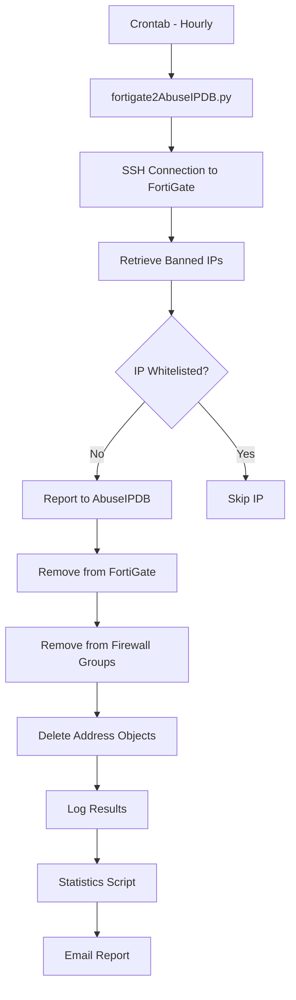

# System Architecture

## 🏗️ Overview

The FortiGate to AbuseIPDB system is an automated integration that:
1. Collects banned IPs from FortiGate devices
2. Reports them to AbuseIPDB
3. Removes reported IPs from FortiGate
4. Generates statistical reports

## 📦 Main Components

### 1. Main Script (`fortigate2AbuseIPDB.py`)

```
┌─────────────────────────────────────┐
│       FortiGateAbuseIPDB            │
├─────────────────────────────────────┤
│ + load_fortigates()                 │
│ + process_fortigate()               │
│ + _get_banned_ips()                 │
│ + _process_banned_ips()             │
│ + _remove_banned_ips()              │
└─────────────────────────────────────┘
```

#### Core Classes:

- **`FortiGateAbuseIPDB`**: Main orchestrator
- **`SSHManager`**: SSH connection management with pooling
- **`AbuseIPDB`**: API client for AbuseIPDB
- **`FortiGateCleaner`**: Cleanup groups and addresses
- **`IPParser`**: FortiGate output parsing
- **`FortiGateVersion`**: Version-specific command management

### 2. Statistics Script (`fortigate2AbuseIPDB_stats.py`)

- Analyzes generated logs
- Creates HTML reports
- Sends email notifications
- WHOIS caching for performance

### 3. Configuration Files

```
/opt/FortiGateToAbuseIPDB/
├── fortigate.list          # FortiGate list
├── fortigate_creds.dat     # Credentials (base64)
├── config_local.py         # AbuseIPDB API key
├── ip_whitelist.txt        # User whitelist
└── /var/log/
    └── fortigate_quarantine.log  # Main log
```

## 🔄 Data Flow



## 🔐 Security

### Credential Management
- FortiGate credentials in base64 file
- AbuseIPDB API key in separate file
- Restrictive file permissions (600)

### Whitelisting
- Pre-configured public DNS
- Customizable user networks
- Private IPs automatically excluded

## 🔌 FortiGate Integration

### FortiGate Automation
The FortiGate has an automation that:
1. Detects failed logins (logid 32002)
2. Bans the IP for 2 hours
3. Creates firewall objects (IPv4 and IPv6)
4. Adds to `Banned_Admin_Failed` groups

### FortiGate Commands

#### FortiOS 7.4:
- `diagnose user banned-ip list` - List banned IPs
- `diagnose user banned-ip delete src4/src6 <IP>` - Remove IP
- `diagnose user banned-ip clear` - Clear all

#### FortiOS 7.0:
- `diagnose user quarantine list` - List banned IPs
- `diagnose user quarantine delete src4/src6 <IP>` - Remove IP
- `diagnose user quarantine clear` - Clear all

## 📊 Database and Storage

### Log Format
```
DD-MM-YYYY HH:MM:SS - [LEVEL] - Message
```

Examples:
```
13-09-2024 15:30:33 - [INFO] - Processing FortiGate: fortigate01.example.com
13-09-2024 15:30:33 - [INFO] - Found banned IP: 1.2.3.4 (cause: DOS)
13-09-2024 15:30:35 - [SUCCESS] - Successfully reported 1.2.3.4 to AbuseIPDB
```

### Attack Categories

| FortiGate Cause | AbuseIPDB Category | ID |
|-----------------|--------------------|----|
| DOS | DDoS Attack | 4 |
| Administrative | SSH Brute-Force | 22 |
| IPS | Hacking | 15 |
| Port Scan | Port Scan | 14 |

## 🔧 Error Handling

### Rate Limiting
- AbuseIPDB: Max 1 report per IP every 15 minutes
- 0.5s delay between API requests
- 429 error handling

### SSH Connections
- Connection pooling
- Keep-alive enabled
- Automatic retry (max 3 attempts)
- Configurable timeout

## 📈 Performance

- **Throughput**: ~100 IPs/minute
- **SSH Connections**: Reusable pool
- **WHOIS Cache**: 90% lookup reduction
- **Log Rotation**: Automatic after 100MB

---

*Last updated: September 2024*